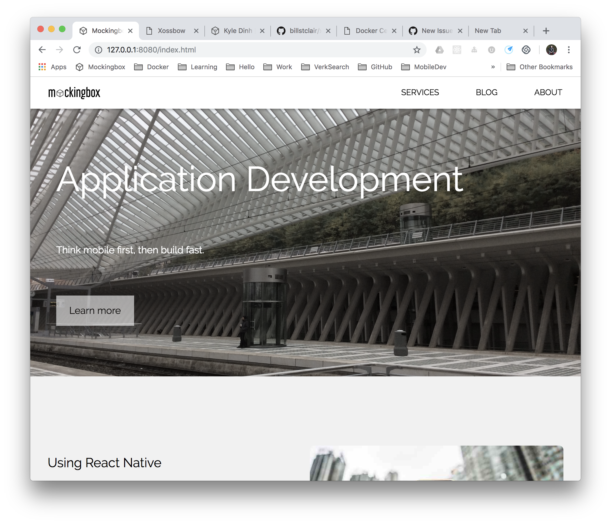

# Moxbow - Flat Site Blogging in Elm

Based on Xossbow framework, made with [Elm](http://elm-lang.org/) and  [billstclair/elm-html-template](http://package.elm-lang.org/packages/billstclair/elm-html-template/latest).

Moxbow will remove the backend parts to make it a Blogging CMS that will updated by builds.

## Build and run

* `bin/build` creates `build` directory
* `cd build/` then `http-server` to run in dev
* open `http://127.0.0.1:8080`

## Size of `index.html` lines
* 24504 build/index.html - original
* 24344 - removed RamDict
* 24324 - removed uploadFile
* 24265 - removed deleteFile
* 24141 - removed Authorization
* 24070 - removed "backend" from settings.json

## Notes from Xossbow

type BackendOperation
    = DownloadFile UploadType String (Maybe String)
    | Authorize Authorization
    | UploadFile Authorization UploadType String String *
    | DeleteFile Authorization UploadType String *

To test compile a file in the `src/` directory, e.g. Xossbow.elm:

    cd .../xossbow
    bin/m Xossbow

To build Xossbow, and put the resulting `index.html` into the `site/` directory:

    cd .../xossbow
    bin/build

[Indexing.md](Indexing.md) contains documentation of the post file format and indexing scheme.
